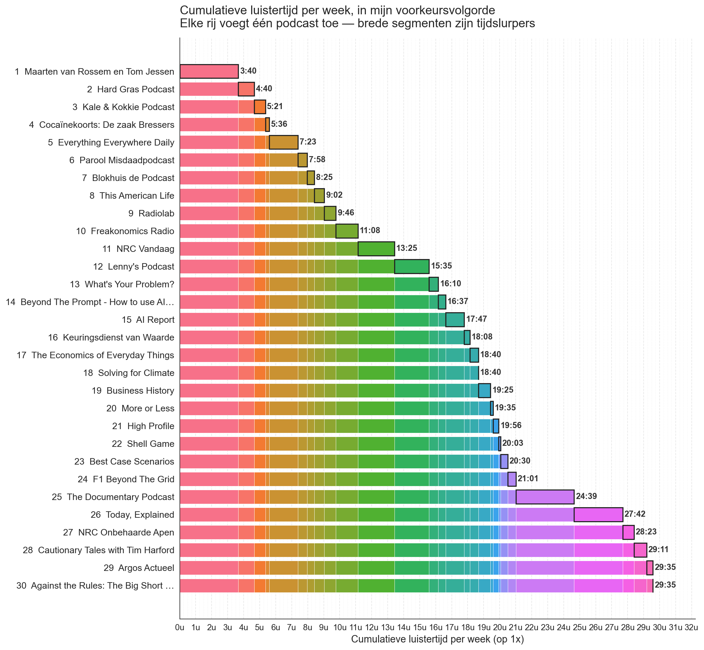

# podcast-time

**How many hours a week would you need just to keep up with all your podcast subscriptions?**

Give it a ranked list of your subscriptions. It fetches each RSS feed, measures episode cadence and duration over the last 90 days, and produces:

- a table of minutes per week per show, plus the cumulative total in your ranked order,
- a Markdown report,
- a stacked-bar chart that makes the "time cliffs" visually obvious.

Ranking without a time budget is wishful thinking. This tool turns your ranking into a budget.



## Install

Python ≥ 3.10. Two ways to install:

**Quickest** — one command, no clone:

```bash
pipx install git+https://github.com/michielb/podcast-time
```

**From a clone** (if you want to read the code or hack on it):

```bash
git clone https://github.com/michielb/podcast-time.git
cd podcast-time
pip install .
```

Either way you get a `podcast-time` command on your path.

## Quickstart

```bash
# 1. List your podcasts, one per line, in ranked order (top = most preferred):
cp podcasts.example.txt podcasts.txt
$EDITOR podcasts.txt

# 2. Run the full pipeline:
podcast-time run
```

That's it. `run` is shorthand for `find-feeds`, `fetch`, `analyze`, `plot` in sequence. Outputs land next to `podcasts.txt`:

- `feeds.json` — resolved feed URLs + match confidence
- `episodes.json` — episode durations from the last 90 days
- `report.md` — the table and totals
- `podcast-stacked-bars.png` — the chart

## Input format

`podcasts.txt` — one show per line, top = highest preference. Blank lines and `#` comments ignored.

```
# My podcasts, ranked
This American Life
Radiolab
Freakonomics Radio
Hard Fork
```

**Overrides.** Append `| <rss-url>` or `| apple:<id>` when auto-lookup gets it wrong:

```
Kale & Kokkie Podcast | https://www.omnycontent.com/d/playlist/.../podcast.rss
Cautionary Tales with Tim Harford | apple:1486005829
```

Overrides short-circuit the iTunes search, so once a show is pinned it'll stay pinned on every subsequent run.

## When a podcast is not found — or matches the wrong show

Feed discovery uses the Apple Podcasts (iTunes) Search API. It's free and usually right on the first try, but not always — a generic title ("Cautionary Tales", "Business History") can match a different show with the same name, and some shows are hosted behind a paywall (Podimo, Spotify-exclusive) with no public RSS at all.

The flow is **flag, review, override, re-run**. Every step is idempotent.

### 1. Run the pipeline; it flags low-confidence matches

```bash
podcast-time run
```

You'll see a summary. Anything with a fuzzy-match score below ~75 is flagged for review:

```
Found 30 feeds.

[ok]   27 confident matches
[?]     3 need review

[  3] Kale & Kokkie Podcast
      Best guess:  "AT5" by AT5                              (score 31, NL)
      Alternatives found:
        "Kale & Kokkie Podcast" by Kale & Kokkie             (score 97, NL)
        https://www.omnycontent.com/d/playlist/.../podcast.rss
      To pin, add this to podcasts.txt:
        Kale & Kokkie Podcast | https://www.omnycontent.com/d/playlist/.../podcast.rss

[ 19] Business History
      Best guess:  "What's Your Problem?" ...
      ...
```

### 2. Don't know the right feed? Use `identify` with a URL you do have

Got a Spotify, Apple Podcasts, or RSS URL? Paste it in:

```bash
podcast-time identify https://open.spotify.com/show/2yPlb6ynbhTJbziSIcykQd
```

Friendly output:

```
Spotify show "Cautionary Tales with Tim Harford"
Publisher:       Pushkin Industries

Searching Apple Podcasts for the RSS feed...

Match found (score 100):
  Title:         Cautionary Tales with Tim Harford
  Artist:        Pushkin Industries
  Apple ID:      1486005829
  Feed:          https://www.omnycontent.com/d/playlist/.../podcast.rss

Feed contents:
  Episodes:      127 total
  Latest:        "The Refugee Who Led a Software Revolution" (4 days ago)
  Last 90 days:  15 episodes, median 41 min (~48 min/week)

Is this the one? Add this line to podcasts.txt:
  Cautionary Tales with Tim Harford | https://www.omnycontent.com/d/playlist/.../podcast.rss
```

`identify` accepts any of:

- a Spotify show URL (`https://open.spotify.com/show/...`) — scraped for title + publisher, then looked up on Apple
- an Apple Podcasts URL (`https://podcasts.apple.com/.../id1486005829`) — resolved by iTunes ID
- an `apple:<id>` shorthand
- a direct RSS URL — parsed to confirm title and episode count
- a plain free-text search term — same engine as `find-feeds`

### 3. Paste the override into `podcasts.txt`, re-run the pipeline

```bash
podcast-time run
```

The override is honored (no lookup), the flag is cleared, and every already-confident match is served from the `feeds.json` cache so you're only spending iTunes calls on shows you just changed. The process is idempotent: same input → same output, every time.

The full loop looks like:

```bash
podcast-time run                                       # flags 2 shows
podcast-time identify https://open.spotify.com/show/XX # -> copy the suggested line
$EDITOR podcasts.txt                                   # paste it in
podcast-time run                                       # flags 1 show
podcast-time identify https://open.spotify.com/show/YY
$EDITOR podcasts.txt
podcast-time run                                       # clean report + chart
```

### 4. What if there is no public RSS?

Some shows are paywalled (Podimo, Spotify-exclusive originals). There is no public feed for those — Apple Podcasts won't have them, and neither will this tool. `identify` will tell you that directly. Options:

- Remove the line from `podcasts.txt` (the show won't count toward the total).
- Add a stub override with `| skip` — the show is kept in the ranking but reported as "no public feed" with zero minutes.
- Use a manual estimate (see below).

### Optional: hand-entered estimates for one or two shows

For a Podimo or Spotify-exclusive show, you can add a line like:

```
Kale & Kokkie Podcast | estimate:eps=1.3,min=32
```

This contributes `1.3 × 32 = 41.6` minutes per week, labelled as an estimate in the report. Use sparingly — the whole point of the tool is to get away from guessing.

## Commands

| Command | What it does |
|---|---|
| `podcast-time find-feeds` | Resolve RSS URLs for every line in `podcasts.txt`; write `feeds.json`; print review summary |
| `podcast-time fetch` | Pull each feed; write `episodes.json` |
| `podcast-time analyze` | Compute per-show + cumulative stats; write `report.md` |
| `podcast-time plot` | Render `podcast-stacked-bars.png` |
| `podcast-time run` | All four, in order |
| `podcast-time identify <url-or-query>` | Friendly "is this the one?" for a single URL/term |

All commands take `--dir <path>` (default: current directory) for where `podcasts.txt` + outputs live.

## How it works

1. **Discovery** (`find-feeds`). iTunes Search API across multiple markets (US, NL, GB, DE, FR). For each title it tries the full string and a simplified variant, scores every returned `collectionName` against the query with `rapidfuzz.token_set_ratio`, deduplicates by Apple `collectionId`, and keeps the top 3. The best is written as the match; the others come along for the ride in case the user needs to pick a different one.
2. **Fetching** (`fetch`). `feedparser` on each URL. Episode duration comes from `<itunes:duration>` (HH:MM:SS, MM:SS, or integer seconds). If missing, falls back to `enclosure length` bytes divided by an assumed 128 kbps. If both fail, the episode is skipped and counted in a `skipped_no_duration` field.
3. **Analysis** (`analyze`). For each show: `eps/wk = episodes_in_window / weeks`, `median_min = median(durations) / 60`. Cumulative total is summed in rank order. The window defaults to 90 days — long enough to smooth out seasonal gaps, short enough that old episodes don't skew the median.
4. **Chart** (`plot`). Horizontal stacked bars. Row N shows ranks 1..N as colored segments, each segment's width = that show's minutes/week. The "jump" when a heavyweight daily is added is visually unmistakable.

## FAQ

**What if I hit an iTunes rate limit (HTTP 403)?** Apple throttles around 20 search requests per minute per IP, and cooldowns can last anywhere from a minute to a few hours if you hammered it. `find-feeds` is designed for this: every successful match is cached in `feeds.json`, so you can re-run after the cooldown and only the still-unresolved shows will re-query. Or resolve those manually with `podcast-time identify <url>` — that's a single targeted request per show and keeps you well under the throttle.

**Why not Spotify's API?** Spotify deliberately doesn't expose RSS feeds through their API. Apple's Search API does, for free, without auth. So Apple is the source of truth for feeds. Spotify URLs are only used as a disambiguation input (their `og:title` / `og:description` tells us which show you meant) before querying Apple.

**Why a 90-day window?** Short enough that a show's recent cadence dominates (catches paused-but-still-subscribed shows as 0 eps/wk), long enough to smooth over vacations and seasonal drops.

**Why `itunes:duration` and not the actual audio file?** Downloading N megabytes per episode for 30 shows × 3 months of episodes would be slow and bandwidth-wasteful when publishers have already declared the length in the feed. The enclosure-bytes fallback is a last resort.

## License

MIT. See [LICENSE](LICENSE).
